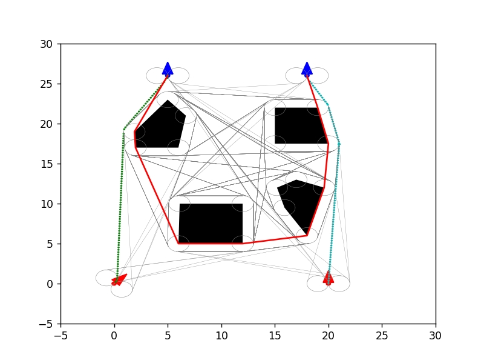
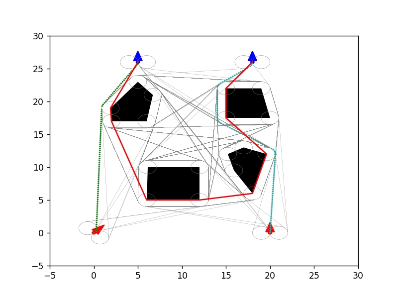
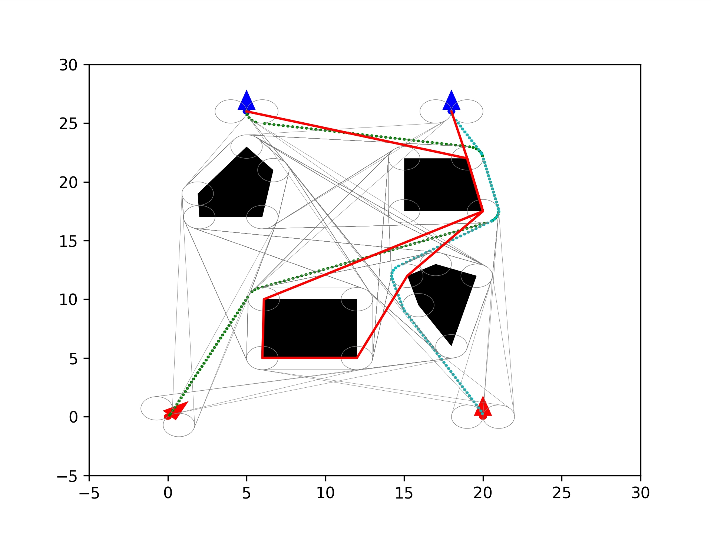
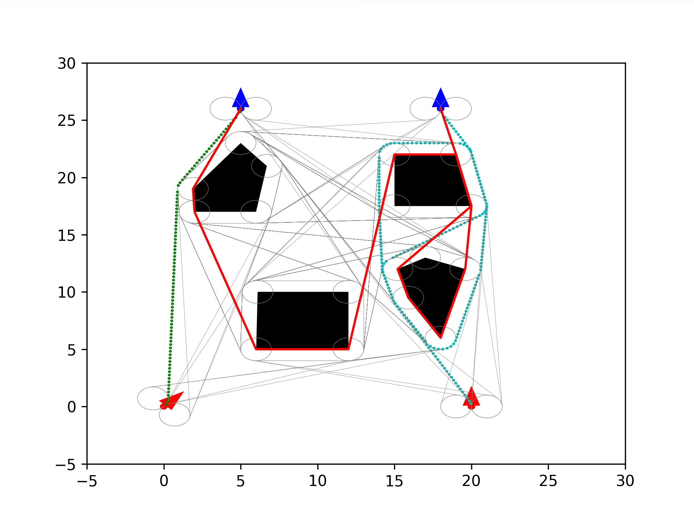
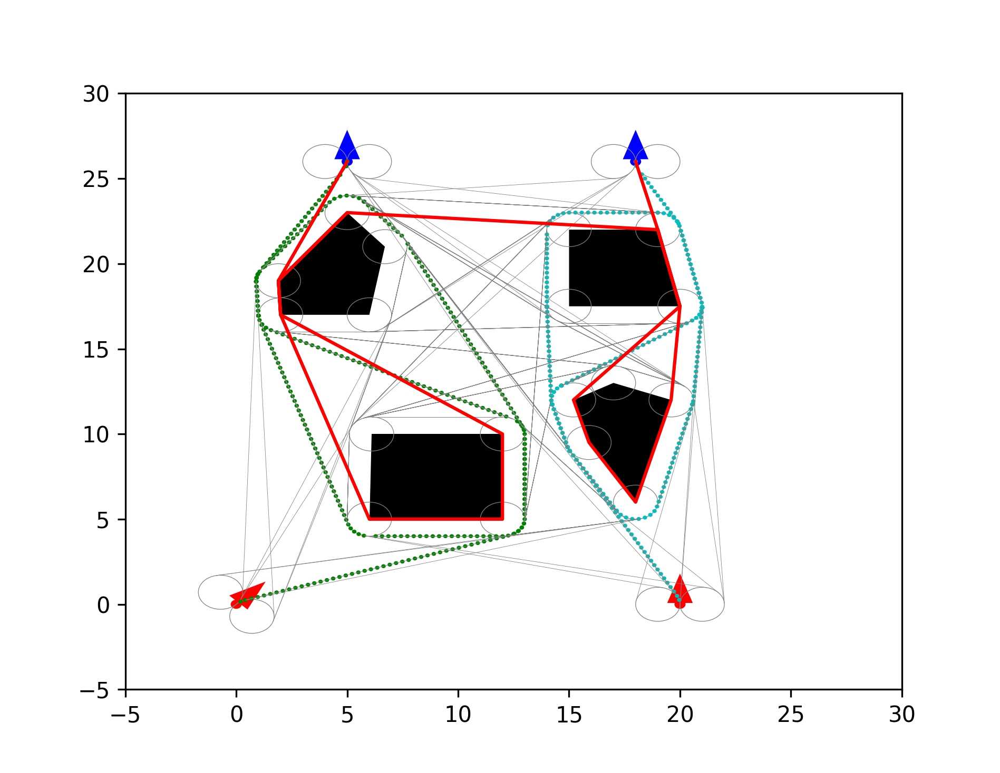

# Motion-Planning-of-Pair-of-Tethered-Robots
A variant of hybrid A* algorithm is developed to find the shortest winding- constrained path for a pair of tethered robots under curvature constraints. 

## Simulation Results

<table align="center">
  <tr>
    <td align="center">
       
      <b>Figure 1: 3.14 rad</b>
    </td>
    <td align="center">
       
      <b>Figure 2: 4.71 rad</b>
    </td>
  </tr>
  <tr>
    <td align="center">
       
      <b>Figure 3: 6.28 rad</b>
    </td>
    <td align="center">
       
      <b>Figure 4: 9.42 rad</b>
    </td>
  </tr>
  <tr>
    <td align="center">
       
      <b>Figure 5: 12.57 rad</b>
    </td>
    <td align="center">
       
      <b>Figure 6: 15.71 rad</b>
    </td>
  </tr>
</table>

